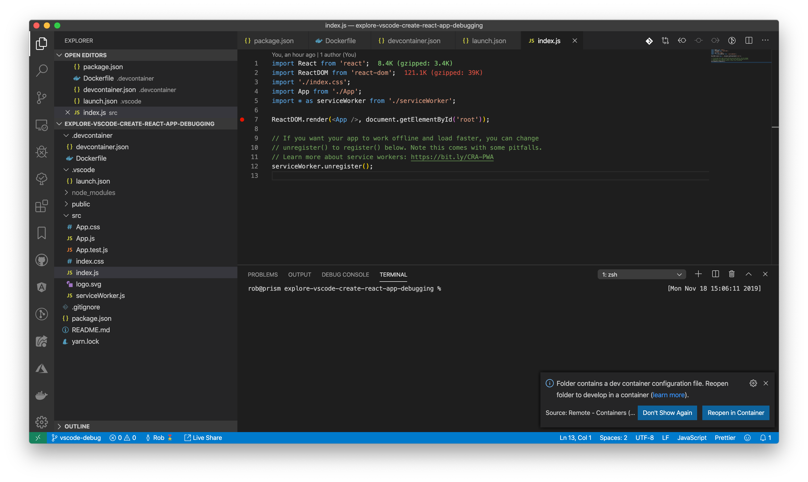
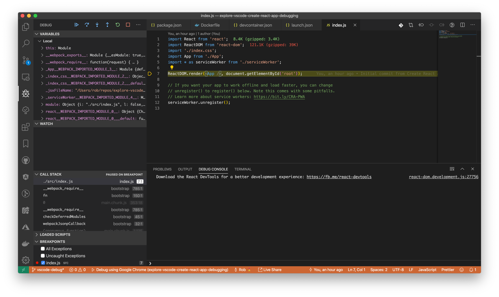

# Welcome

This project was created to explore debugging a standard [create-react-app](https://create-react-app.dev) app with [VS Code](https://code.visualstudio.com) for the following situations:

+ A locally running React application
+ Using [VS Code](https://code.visualstudio.com) to [develop and debug inside a Docker container](https://code.visualstudio.com/docs/remote/containers)

If you have no idea what [developing and debugging inside a Docker container](https://code.visualstudio.com/docs/remote/containers) is, don't worry. I just learned about it today 🤓

## Getting started

For the purposes of this README, you can either follow along with the example repo or you can create your own app on your development machine.

If you are going to create your own app, feel free to follow the optional step below. Otherwise, please skip down to `Level 0 - Debug a locally running React application`

### [OPTIONAL] Create a new app

To create a new React app, please start from an empty directory and run `npx create-react-app <your-app-name>` - which will create the standard [create-react-app](https://create-react-app.dev) we've all come to know and love:

```sh
# Let's start off in your home directory
$ cd ~

# Use Facebook's create-react-app
$ npx create-react-app my-example-app

# Navigate to the newly created directort
$ cd my-example-app

# Create a .devcontainer directory
#   -> Be sure to copy `devcontainer.json` and `Dockerfile` to this folder
$ mkdir .devcontainer

# Create a .vscode directory
$ mkdir .vscode
#   -> Be sure to copy `launch.json` to this folder

```

## Level 0 - Debug a locally running React application

This project contains two folders you may already be familiar with - `public` and `src`. These folders are automatically generated with the [create-react-app](https://create-react-app.dev) tool.

To debug our locally running React application, simply start the application by running:

```sh
$ npm run start
Compiled successfully!

You can now view explore-vscode-create-react-app-debugging in the browser.

  Local:            http://localhost:3000/
  On Your Network:  http://10.105.156.212:3000/

Note that the development build is not optimized.
To create a production build, use yarn build.
```

Now that our application is running, let's add a breakpoint to `src/index.js` by clicking to the left of a statement:



Launch the VS Code debugger by clicking on the debug icon or navigating to View > Debug in the toolbar.

Make sure `Debug using Google Chrome` is selected and press the green play button:



Congratulations! You can now explore your application using the VS Code debugger instead of pesky `console.log` statements.

Please see the [VS Code Debugging guide](https://code.visualstudio.com/docs/editor/debugging) for more information.
