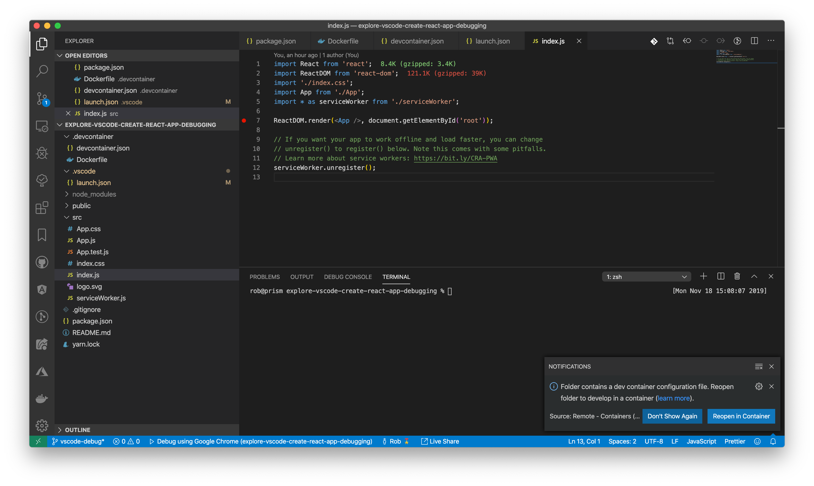
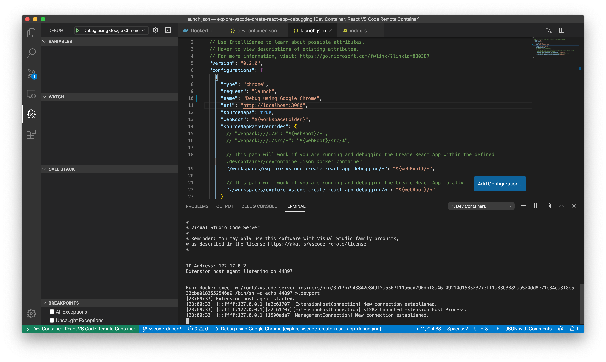
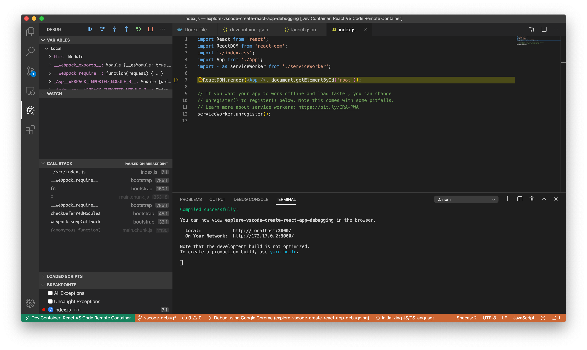

# Welcome

This project was created to explore debugging a standard [create-react-app](https://create-react-app.dev) app with [VS Code](https://code.visualstudio.com) for the following situations:

+ A locally running React application
+ Using [VS Code](https://code.visualstudio.com) to [develop and debug inside a Docker container](https://code.visualstudio.com/docs/remote/containers)

If you have no idea what [developing and debugging inside a Docker container](https://code.visualstudio.com/docs/remote/containers) is, don't worry. I just learned about it today 🤓

## Getting started

For the purposes of this README, you can either follow along with the example repo or you can create your own app on your development machine.

If you are going to create your own app, feel free to follow the optional step below. Otherwise, please skip down to `Level 0 - Debug a locally running React application`

### [OPTIONAL] Create a new app

To create a new React app, please start from an empty directory and run `npx create-react-app <your-app-name>` - which will create the standard [create-react-app](https://create-react-app.dev) we've all come to know and love:

```sh
# Let's start off in your home directory
$ cd ~

# Use Facebook's create-react-app
$ npx create-react-app my-example-app

# Navigate to the newly created directory
$ cd my-example-app

# Create a .devcontainer directory
#   -> Be sure to copy `devcontainer.json` and `Dockerfile` to this folder
$ mkdir .devcontainer

# Create a .vscode directory
$ mkdir .vscode
#   -> Be sure to copy `launch.json` to this folder

```

## Level 0 - Debug a locally running React application

This project contains two folders you may already be familiar with - `public` and `src`. These folders are automatically generated with the [create-react-app](https://create-react-app.dev) tool.

To debug our locally running React application, simply start the application by running:

```sh
$ npm run start
Compiled successfully!

You can now view explore-vscode-create-react-app-debugging in the browser.

  Local:            http://localhost:3000/
  On Your Network:  http://10.105.156.212:3000/

Note that the development build is not optimized.
To create a production build, use yarn build.
```

Now that our application is running, let's add a breakpoint to `src/index.js` by clicking to the left of a statement:


Launch the VS Code debugger by clicking on the debug icon or navigating to View > Debug in the toolbar.

Make sure `Debug using Google Chrome` is selected and press the green play button:


Congratulations! You can now explore your application using the VS Code debugger instead of pesky `console.log` statements.

Please see the [VS Code Debugging guide](https://code.visualstudio.com/docs/editor/debugging) for more information.

## Level 1 - Debug a React application running in a Docker container

Now the fun part. You can define local development containers to run (and debug) your apps in VS Code.

According to the first few paragraphs of [Developing inside a Container](https://code.visualstudio.com/docs/remote/containers):

> The Visual Studio Code Remote - Containers extension lets you use a Docker container as a full-featured development environment. It allows you to open any folder inside (or mounted into) a container and take advantage of Visual Studio Code's full feature set. A devcontainer.json file in your project tells VS Code how to access (or create) a development container with a well-defined tool and runtime stack. This container can be used to run an application or to sandbox tools, libraries, or runtimes needed for working with a codebase.

> Workspace files are mounted from the local file system or copied or cloned into the container. Extensions are installed and run inside the container, where they have full access to the tools, platform, and file system. This means that you can seamlessly switch your entire development environment just by connecting to a different container.

We're going to be:

+ Creating a Dockerfile to represent our development environment
+ Define our development container with VS Code extensions we want to use, default shell, etc
+ Start your application **within the Docker container**
+ Define a VS Code debug configuration
+ Define a breakpoint in the application

### Create a Dockerfile for your development environment

The first step is to define a Dockerfile - see `.devcontainer/Dockerfile` for example - that will build the base environment for your application.

In our example, notice how we're simply building a Node.js environment with a little special sauce to use [zsh](http://zsh.sourceforge.net) as our base shell.

```sh
FROM node:10

RUN apt-get update

RUN apt-get install -y zsh

RUN yarn global add eslint

RUN wget https://github.com/robbyrussell/oh-my-zsh/raw/master/tools/install.sh -O - | zsh || true

CMD ["zsh"]
```

### Define .devcontainer/devcontainer.json

In the previous step, we created a `Dockerfile` to define the development environment we want to work with. In this step, we're going to create `.devcontainer/devcontainer.json`.

Our file is going to be relatively simple:

+ `name` - Totally up to you.
+ `dockerFile` - We're going to use a custom `Dockerfile` here, but if you're really curious check out [Using an image or Dockerfile](https://code.visualstudio.com/docs/remote/containers#_using-an-image-or-dockerfile)
+ `appPort` - Defines the port(s) we are publishing
+ `extensions` - This is an array of strings representing all VS Code extensions you want accessible to you in this container
  + PRO TIP: To generate a list of all installed extensions for your VS Code environment, you can simple run `$ code --list-extensions`
+ `settings` - In this example, we want to explicitly specify that `zsh` is going to be our default shell

```sh
{
  "name": "React VS Code Remote Container",
  "dockerFile": "Dockerfile",
  "appPort": 3000,
  "extensions": [
    "CoenraadS.bracket-pair-colorizer",
    "hazer.ReactCodeSnippets",
    "Tyriar.sort-lines"
  ],
  "settings": {
      "terminal.integrated.shell.linux": "/bin/zsh"
  }
}
```

Please see [Developing inside a Container](https://code.visualstudio.com/docs/remote/containers) for more information and advanced uses.

### Start your application within the Docker container

You may have noticed a notification prompting you to `Reopen in Container` - click that button now so we can have VS Code build our development environment:



Once the development environment has been built, you will see the following if you view details:



At this point, we have our local environment up and running. We need to start our React application by opening another terminal window:


If we try running either `pwd` or `ls`, you can see that we are safely running VS Code within our terminal.

Let's start our application:

```sh
$ npm run start
```

### Define a VS Code debug configuration

Let's look at our example VS Code debug configuration in `.vscode/launch.json`

The key properties that we needed to define were:

+ `url` - Our locally running web server
+ `sourceMaps` - Set to `true`
+ `webRoot` - This is important. Since we have `./src` for our React app, we just need to use `${workspaceFolder}` as the value. Otherwise, we'd have to modify that path appropriately if we had apps further down the directory tree.
+ `sourceMapPathOverrides` - This is critical. We need to explicitly tell our debugger how to resolve paths to our local code.

```sh
{
  "version": "0.2.0",
  "configurations": [
    {
      "type": "chrome",
      "request": "launch",
      "name": "Debug using Google Chrome",
      "url": "http://localhost:3000",
      "sourceMaps": true,
      "webRoot": "${workspaceFolder}",
      "sourceMapPathOverrides": {
        // "webpack:///./*": "${webRoot}/*",
        // "webpack:///./src/*": "${webRoot}/src/*",

        // This path will work if you are running and debugging the Create React App within the defined .devcontainer/devcontainer.json Docker container
        "/workspaces/explore-vscode-create-react-app-debugging/*": "${webRoot}/*",

        // This path will work if you are running and debugging the Create React App locally
        "./workspaces/explore-vscode-create-react-app-debugging/*": "${webRoot}/*"
      }
    }
  ]
}
```

### Define a breakpoint in the application

Similar to our earlier example, let's set a breakpoint in our application in `src/index.js`

Launch the VS Code debugger by clicking on the debug icon or navigating to View > Debug in the toolbar.

Make sure `Debug using Google Chrome` is selected and press the green play button:



Congratulations! You can now explore your application using the VS Code debugger instead of pesky `console.log` statements.

Please see the [VS Code Debugging guide](https://code.visualstudio.com/docs/editor/debugging) for more information.
